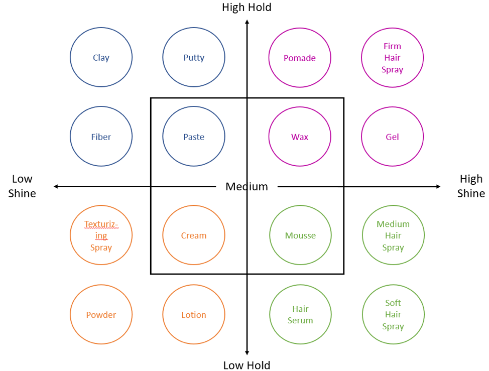

# 记一些英语单词

## 玩儿游戏也能学英语-血源诅咒篇

人物属性：

>Arcane adj.神秘的 understood by few, mysterious and secret.

初始人物出生：

>Milquetoast n.胆小鬼 A person who is timid or submissive.

>timid adj.胆小的 showing a lack of courage or confidence; easily frightened.

>submissive adj.顺从的 ready to conform to the authority or will of others; meekly obedient or passive.

>frightened adj.害怕的 afraid or anxious

>meekly adj.温柔的

>obedient adj.听话 complying or willing to comply with orders or requests; submissive to another's will.

>passive adj.被动 accepting or allowing what happens or what others do, without active response or resistance.

Ordinary, happy upbringing. 

普通，快乐地成长

>upbringing n.教养 the treatment and instruction received by a child from its parents throughout its childhood

Lone survivor of lost hamlet.High life essence and vigour.

失落村庄的孤独幸存者。非常具有活力。

>hamlet n.村庄 a small settlement, generally one smaller than a village.

>vigour n.活力 physical strength and good health.

Highly resilient as a result.

有很强的适应力

>resilient adj.弹性的 (of a substance or object) able to recoil or spring back into shape after bending, stretching, or being compressed

>substance n.物质 a particular kind of matter with uniform properties.

>recoil v.畏缩 n.后坐力 suddenly spring or flinch back in fear, horror, or disgust.

>flinch n.退缩 make a quick, nervous movement of the face or body as an instinctive reaction to surprise, fear or pain.

>instinctive adj.本能地 relating to or prompted by instinct; apparently unconscious or automatic.

>disgust n.厌恶 a feeling of revulsion or profound disapproval aroused by something unpleasant or offensive.

>revulsion n.排斥 a sense of disgust and loathing.

>loath n.厌恶 a feeling of intense dislike or disgust; hatred.

>hatred n.仇恨 intense dislike or ill will.

>bending n.弯曲 shape or force (something straight) into a curve or angle.

Noble Scion
scion n.继承人 a descendant of a notable family

descendant n.后辈 a person, plant, or animal that is descended from a particular ancestor.

## 玩游戏也能学英文——Fire Emblem: Shadow Dragon

> Axe-wielding clansmen from outlying kingdoms.

遥远王国中挥舞着斧子的族人。

outlying adj.边远的

clansman n.氏族(或宗族)成员

> Seasoned fighters with unparalleled strength and stamina.

经验老道的战士，有着极高的力量与耐力。

seasoned adj.富有经验的

stamina n.耐力

> Magic users who wield tomes as weapons.

使用魔法书为武器的魔法师。

tome n.(尤指理论性的) 大部头书

> Seasoned mages capable of wielding tomes and staves alike.

经验老道的魔法师，可以使用魔法书和杖。

stave n.棍; 棒; 木柱; 五线谱;

sorcerer n.	(故事中的) 术士

> Long ago, Medeus, king of the dragonkin, conquered the continent of Archanea.

很久以前，龙族之王Medeus征服了Archanea大陆。

continent n.大陆

> That tyranny was broken, however, when an unlikely hero intervened.

然而一位奇迹般的英雄出现，击败了龙王的暴政。

tyranny [ˈtɪrəni] n.暴虐

intervene [ɪntərˈviːn] v.出面

## 玩游戏也能学英语-ONINAKI篇

Reincarnation is the way of our land.

轮回是这片土地的规律。

>reincarnation n.投胎 the rebirth of a soul in a new body.

She still holds distant memories of fleeting happiness and an instance of love.

她仍然对转瞬即逝的快乐和爱保有回忆。

>fleeting adj.转瞬即逝 lasting for a very short time.

Aisha can dash to move quickly across the battlefield, and the swords she wields strike fast and hard, making her a well-balanced warrior.

Aisha可以在战场上快速穿梭，舞剑快而狠，是属性平衡的勇士。

>wield v.挥 hold and use (a weapon or tool).

Kagachi prefers to keep to himself, performing his duties as a Watcher with cool detachment.

Kagachi希望保全自己，以一种冷酷超然的态度履行作为一名Wather的职责。

>detachment m.超然，分离 the action or process of detaching; separation.

A natural world brimming with life,where creatures high and low rejoice in being alive.

一个充满生机的自然世界，生物开心的生存着。

>brimming adj.充满 fill or be full to the point of overflowing.

>rejoice v.开心 feel or show great joy or delight.

A world that exists in parallel with the Living World,occupying the same space, separated by a thin veil.

一个与自然世界平行存在的世界，占据着相同的空间，被一层薄薄的面纱分离。

>veil n.面纱 a piece of fine material worn by women to protect or conceal the face.

>conceal v.隐藏 keep from sight; hide.

A nexus appears when you defeat a Sight Stealer,a rear type of Fallen that appears wreathed in a noxious miasma.

>nexus n.关系 a connection or series of connections linking two or more things.

>noxious n.有毒的 harmful, poisonous, or very unpleasant.

>miasma n.瘴气 a highly unpleasant or unhealthy smell or vapor.

vapor n.蒸汽 a substance diffused or suspended in the air, especially one normally liquid or solid.

This also bestows special effects known as Precepts on you and Fallen within.
bestow v.被赐予 confer or present (an honor, right, or gift).

## 关注时尚也能学英语

hair oil 发油

hair cream 发乳

hair spray 喷发定型剂
>spray n.喷剂 v.喷 

hair wax 发蜡

>wax n.蜡 v.给…打蜡

>pomade n.发蜡

hair clay 发泥
>clay n.黏土

hair gel 发胶/啫喱
>gel n.凝胶 v.联手共事

>mousse n.慕斯蛋糕 vt.在…上抹摩丝;（从广义上来看，摩丝（Mousse）指由液体和推进剂共存，在外界施用压力下，推进剂携带液体冲出气雾罐，在常温常压下形成泡沫的产品。在这层意义上，形成了发用摩丝、摩丝香波、摩丝沐浴剂、摩丝剃须膏等各类产品。）

关于上面几种头发定型产品的区别,可以从oil-based（基于油），water-based（基于水），hold（定型程度），shine（闪亮程度）这几个维度去分别，参见medium文章[Pomade, Clay, Paste, Gel, Sprays? What product is right for you and your customers?](https://medium.com/@petraprivatelabel/pomade-clay-paste-gel-sprays-what-product-is-right-for-you-and-your-customers-57cbb9d76988)

>comb n.梳子 v.梳

>towel n.毛巾 v.用毛巾擦干
