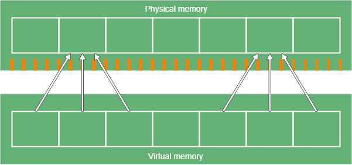
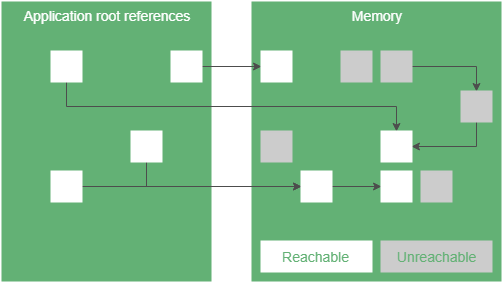

# JVM ZGC 简介

如今服务端面向百万级的客户端服务的场景已经越来越常见。这样的程序需要大量的内存，传统方法管理这些内存也会导致一些性能问题。

Java 11 引入的实验性GC实现：ZGC，便是为了解决这个问题。

本文介绍ZGC如何在高达TB级的堆中以极低的暂停时间回收内存。

## 基本概念

为了理解ZGC如何工作，首先需要了解一些内存管理和GC有关的基础概念和理论。

### 内存管理

物理内存，是电脑硬件提供的内存。虚拟内存，是操作系统堆为每个应用分配的内存。我们将**虚拟内存存储到物理内存中，并且OS实时地维护两者的映射**。

### 多重映射（Multi-mapping）

多重映射意味着虚拟内存中有指向物理内存的特殊地址。由于程序通过虚拟内存访问数据，程序不知道也不需要知道这里的底层机制。

**实际上，os会把相同区域的物理内存分配到多块物理内存当中。**

看上去这样做并没有什么好处，但是这是ZGC实现的基础，并且由于这种机制分离了应用程序的间的内存空间，保障了安全性。

### 再分配

由于使用动态内存分配，普通程序的内存会随着运行时间推移变得碎片化。这是因为在内存中清除对象时，会留下那段内存被释放后的内存间隙。随着时间流逝，间隙不断积累，内存会变得像是由可用空间和已用空间交织的棋盘格。

当然我们可以尝试使用新对象去填补这些空白。要做到这一点，可以扫描内存，去找到足够容纳新对象的可用空间。如果每次分配内存都要执行这种操作，将会非常耗时。此外，由于有可能不能找到刚好大小合适的内存空间，内存仍将是零碎的，对象间将存在非常小的间隙。也可以尝试最小化这些间隙，但也需要更多的处理资源。

另外一种策略是更频繁地**从碎片化的内存中，移动对象到一块新的可用区域，使分区更加紧凑**。为了追求效率，可以把内存分割为一个个小区块，移动对象以填满区块，或保持区块为空。这样下来，由于知道这些一整块为空的区块的存在，内存分配将会更加快速。

### GC

上面讲的是JVM出现前的情况（回顾大学里操作系统课的内容）。当创建java程序时，我们其实不用释放我们分配出去的内存，因为垃圾收集器会帮我们全部搞定。**GC通过引用链监视着程序中无法到达的对象，并且释放这些对象占用的内存**。

GC需要跟踪堆空间中对象的状态来完成工作。举个例子，**可达状态**意味着程序保有这个对象的引用，当然这个引用也是可传递的，只要程序可以访问这些引用找到对象即可。另一个状态是**可终结状态**：无法访问的对象即为可终结的，这些对象就是我们要去回收的垃圾。

GC会走多个步骤去获取堆空间的对象可达性信息。

### GC阶段

GC阶段有着不同的属性

- parallel阶段可以运行多个GC线程
- serail阶段运行在单个线程上
- stop-the-world阶段不能与应用代码一同运行
- concurrent阶段可以在后台工作，程序可照常运行
- increment阶段可以在结束前暂停所有的工作，并且稍后重启

上述所有技术都有其优缺点。举个例子，假设有一个可以和我们的程序代码并发运行的阶段。使用serial实现只需要1%的cpu占用，但是需要运行1000毫秒。而相反，使用parallel实现需要占用30%的cpu并且仅仅50ms完成工作。

看起使用parallel实现非常快，但是**parallel的解决方案使用了更多cpu，因为它更加复杂并且必须同步线程**。对于cpu占用高的应用（像批处理）就不太适合，因为用于真正有意义的工作的cpu变少了。

虽然这只是举个例子，但是很明显所有程序都有它自己的特征，不同的程序会有不同的GC要求。（软件工程没有银弹）

## ZGC概念

ZGC的目标是让stop-the-world阶段尽可能短，并且暂停时间不会随着堆大小的增大而增大。**这些特性使ZGC更加适应占内存极大的服务端程序，或者是那些需要快速响应的程序。**

### 总览

ZGC有一个叫Marking的阶段，目标是找到可达的对象。GC有多种方式存储对象状态信息。举个例子，我们可以创建一个Map，key为内存地址，值为那个地址中对象的状态。这样存储非常简单容易，但是需要额外的内存来存储这些信息。维护这些Map也有难度。

**因此ZGC使用了一个不同的方法：它用引用的位（bit）来存储引用状态**。（看不懂这句话的话可以暂时忽略，下文会讲。）这被称为**引用着色**（reference coloring）。但是这又带来一个新问题。设置引用的位以存储关于对象的元数据，意味着多个引用可以指向同一对象，因为状态位不持有任何有关对象位置的信息。这个问题可以使用上文提到的多重映射（Multi-mapping）解决。

ZGC还可以通过重定位（relocation）来减少内存碎片。但是对于比较大的堆来说，重定位是一个非常缓慢的过程。**由于ZGC不希望长时间的暂停，因此它并行地在程序运行时重定位。** 但是这又导致了新问题。

假设我们现在有一个对象的引用。ZGC将内存区域重定位时发生了上下文的切换，应用程序线程这时会尝试以老地址访问对象。ZGC使用**负载屏障**(load barriers)去解决这个问题。**负载屏障是当一个线程从堆中加载引用时，运行的一段代码**。比如当我们访问对象的**非原始（non-primitive）类型对象**字段时，就是从堆中加载引用的过程。

在ZGC中，负载屏障检查了引用的元数据位。根据这些比特位，ZGC可能会在我们拿到这些引用前执行一些处理。因此实际上我们可能会拿到完全不同的应用。这个步骤叫做重映射（remapping）。（注意不是上面的多重映射Multi-mapping）。

### 标记/Marking

ZGC将Marking分为三个阶段来执行。

- 第一个阶段是stop-the-world。在这个阶段中，我们根据根引用进行标记。**根引用是到达堆中对象的起点。** 比如局部变量或静态变量就是根引用。由于根引用的数量一般比较少，因此这个阶段非常短暂。
- 下一个阶段是concurrent（并发）。在这个阶段， **ZGC会从根引用开始遍历对象图，标记每一个到达的对象。** 同样的，当负载屏障检测到未标记的引用，它也会标记它。
- 最后一个阶段仍然是stop-the-world，用于处理一些边缘情况（像弱引用之类的）。

自此，我们可以知道哪些对象是可达的。ZGC会使用*marked0*和*marked1*元数据位来标记。

### 引用着色/Reference Coloring

引用表示了虚拟内存中字节的位置。然而并不需要使用引用的全部比特位来表示位置（这给我们使用引用本身去标识引用状态留下了操作空间）， **一些比特位代表着引用的属性。** 这就是所谓的引用着色。

在32位os中，我们只能寻址4GB。但是现代计算机的内存一般不止这么点，所以这32位没有一位可以拿来着色。因此ZGC使用的是64位引用，ZGC也只在64位平台可用。

ZGC使用42比特位来代表地址本身。这意味着ZGC可以寻址至多4TB的内存空间。

如上图所示，ZGC有4比特位来存储引用状态：

- **finalizable bit** 该对象只能被GC的finalizer访问。
- **remap bit** 引用状态是最新的，指向对象的当前位置。（详见上文的重定位）
- **marked0** 和 **marked1**。用于标记可达对象

### 重定位/Relocation

在ZGC中，重定位由下列几个阶段组成。

1. concurrent阶段，这个阶段会查找需要重定位的内存区块，并且将其放入重定位集。
2. stop-the-world阶段，将重定位集中的所有根引用重新定位，并且更新引用。
3. concurrent阶段，重定位所有重定位集中剩下的对象，并且在转发表中存储老地址到新地址间的映射。
4. 其余引用的重写会发生在下一个标记阶段。这样就不需要遍历对象树两次。负载屏障也可以起这个作用

### 重映射与负载屏障

在重定位阶段,对于重定位了的地址，大多数的引用并没有被改写。因此，如果访问这些引用，我们是没办法找到想要的对象的。更糟糕的情况是，我们可能会访问到垃圾。

ZGC使用了负载屏障来解决这个问题。**负载屏障了修复引用指向问题以指向重定位后的对象，它使用到了被称为重映射的技术。**

当应用加载引用时就会触发负载屏障，然后依据下面的步骤返回正确的引用：

1. 检查*remap* bit是否被设置为了1。如果是1，则表示引用是最新的，可以安全地返回这个引用。
2. 然后检查被引用的对象是否在重定位集中。如果不在重定位集中，那就意味着这个对象不需要被重定位（引用已经被更新）。接下来为了避免下一次再进行这个检查，把*remap* bit设置为1，并且返回更新的引用。
3. 到了这一步，我们可以得知访问的对象是重定位集以内的对象。下面的问题是确定这个对象是否被重定位过。如果该对象曾经被重定位，直接跳到下一步。反之，现在就开始进行对象的重定位，并且在转发表中增加一个新条目，用以记录对象重定位后的新地址。之后进行下一步。
4. 现在可以确定这个对象已经被重定位过了。要么是上一步ZGC对其进行了重定位，要么是更早以前的负载屏障对该对象进行了操作。现在更新这个对象的新引用（使用上一步的地址或者通过查找转发表查找到新地址），设置好*remap* bit，返回这个引用。

每次加载引用时都会触发负载屏障，重复上面的步骤，以确保每次访问对象时，都可以取到最新的引用。这实际上会稍微降低程序执行的性能，特别是第一次访问重定位的对象时。但是这是为了缩短暂停时间所必须付出的代价。并且由于这些步骤相对较快，因此不会太显著影响地程序的性能。（实际上就是在完全冻结主程序，和并行运行主程序中招平衡）

## 现在就开启ZGC！

在运行程序时使用以下命令即可启用ZGC：

>-XX:+UnlockExperimentalVMOptions -XX:+UseZGC

这玩意到目前未知都是实验性GC，但是相较于java11，现在的java13可以支持高达16TB的heap size。（那么看完了这篇文章的你应该能反应过来引用位的变化）

另外java13也添加了zgc的mac os支持，在下一个java14中，将会添加Windows的支持。这样应该算是全平台可用了。