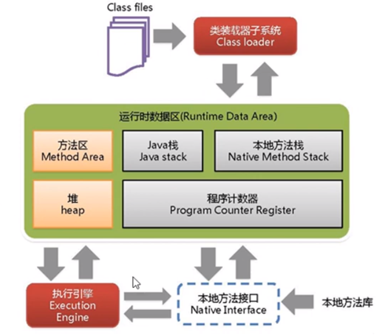
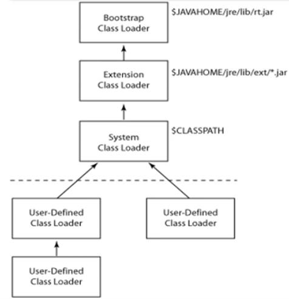
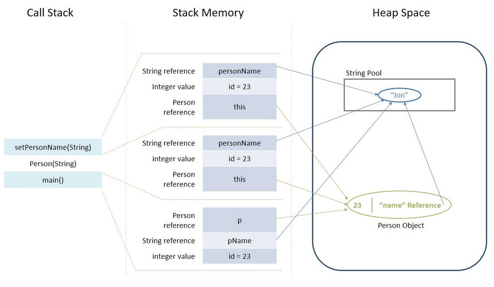

# 一些jvm笔记

## jvm笔记

jvm运行在操作系统上，它与硬件没有直接交互。

java中负责对字节代码解释执行的是虚拟机。

体系结构：



### 类加载器/Class Loader

负责加载class文件，class文件在文件开头有特定的文件标示。并且ClassLoader只负责class文件的加载，至于它是否可以运行，则由Execution Engine决定。



#### 虚拟机自带的加载器

- 启动类加载器：BootstrapClassLoader （cpp实现）
- 平台类加载器：PlatformClassLoader （java实现）
- 应用类加载器：AppClassLoader （java实现，也叫做“系统类加载器”）

启动类加载器，负责加载JVM虚拟机运行时所需的基本系统级别的类，如java.lang.String, java.lang.Object等等。启动类加载器无法通过`any.javaClass.classLoader`的方式取得。（因为它不是java实现的）

平台类加载器之前叫Extension Class Loader，但是java 9 之后为了支持模块系统，扩展机制被删除。

在java 9 之后，运行下列代码：

``` kotlin
class MyClass

fun main() {
    val myClass=MyClass()
    println(myClass.javaClass.classLoader)
    println(myClass.javaClass.classLoader.parent)
    println(myClass.javaClass.classLoader.parent.parent)
}
```

会打印:

```
jdk.internal.loader.ClassLoaders$AppClassLoader@42a57993
jdk.internal.loader.ClassLoaders$PlatformClassLoader@eed1f14
null
```

##### 双亲委派

双亲委派模型工作过程：一个类加载器收到类加载的请求，它首先会把这个请求委派给父类加载器去完成，层层上升，只有当父类加载器无法完成此加载请求时，子加载器才会尝试自己去加载。

要注意的是父加载器和子加载器的关系不是继承关系而是组合关系。子加载器中有一个私有属性 parent 指向父加载器。

##### 沙箱机制

沙箱安全机制是由基于双亲委派机制上，采取的一种JVM的自我保护机制,假设自己写一个java.lang.String 的类,在类中自定义方法，由于双亲委派机制的原理,此请求会先交给Bootstrap试图进行加载,但是Bootstrap在加载类时首先通过包和类名查找rt.jar中有没有该类,有则优先加载rt.jar包中的类,没有自定义方法会报错，因此就保证了java的运行机制不会被破坏。

#### 用户自定义的加载器

java.lang.ClassLoader的子类，用户可以自定义类的加载方式。

### 执行引擎 / Execution Engine

Execution Engine负责解释命令，提交给操作系统执行。

### 本地接口 / java native interface / JNI

用于调用c/cpp方法

### 本地方法栈 / Native Method Stack

Native Method Stack中登记native method，Execution Engine执行时加载本地方法库。

### 程序计数寄存器 / Program Counter Register

每个线程都有一个程序计数器。是线程私有的，就是一个指针，指向方法区的方法字节码（用来存储指向下一条指令的地址），由执行引擎读取下一条指令，是一个非常小的内存空间，几乎可以忽略不计。

## 方法区 / Method Area

方法区被所有线程共享，所有字段和方法字节码，以及一些特定的方法如构造函数，接口也在此定义。所有定义的方法的信息都保存在该区域，**此区属于共享空间**。

静态变量+常量+类信息（构造方法/接口定义）+运行时常量池存在方法区中。

但是实例变量存在堆内存中，和方法区无关。

## JVM中的堆和栈

为了让程序可以以最佳的状态运行，java把内存分为了堆和栈。**每当我们声明新的对象和变量，调用新的方法，声明字符串或执行更多此类相似的操作，JVM都会从堆或栈中为这些操作分配空间。**

本文将讨论这两个内存模型。我将会列举堆和栈的几个关键的不同，以及阐述它们是如何存储在物理内存中的，还有它们提供给我们的一些特性，何时去使用它们。

### java中的栈

**java中的栈被用于静态内存分配和执行线程。** 它包含函数中的原始类型值，和函数中的引用，这些引用指向的对象存储在堆中。

访问栈中内存需要按照后进先出的顺序。每当调用一个新方法时，栈顶就会创建一个新的区块，这个区块包含了和这个函数有关的一些特定的值，例如原始类型变量和对象的引用。

该方法执行完毕后，将刷新相应的堆帧，数据回流到所调用方法中，该区块被清空，为下一个要执行的函数腾出空间。

#### 栈的关键特性

除了上文讨论的内容，栈还有如下特性：

- 随着新方法的调用和返回，栈的大小会自动增长和收缩。
- 栈中的变量仅在创建这些变量的方法运行时存在。
- 方法执行完毕后栈内空间会自动分配和释放。
- 如果栈内存已满，java会丢出*java.lang.StackOverFlowError*异常。
- 相比与访问堆内存，访问栈内存更快。
- 栈内存是线程安全的，因为每个线程只操作自己的栈。

### java中的堆

**java中的堆空间被用于java对象和JRE类在运行时的动态内存分配。** 新的对象总是在堆中创建，并且该对象的引用被存储在栈中。

这些对象具有全局访问属性，可以从程序的任何位置被访问。

在之前的JVM实现中堆中会被细分为世代以便于GC回收内存，但是新的ZGC已经不通过世代来回收内存，每次GC都会标记整个堆空间。故有关世代的内容本文不再阐述。

#### 堆的关键特性

除了上文提到的内容，堆还有如下特性：

- 如果堆已满，会抛出*java.lang.OutOfMemoryError*异常
- 对该堆内存的访问会比栈内存慢
- 与栈相比，堆空间不会自动释放。它需要GC去清空无用的对象，以保持内存使用的效率
- 与栈不同，堆不是线程安全的，并且需要被正确的同步代码保护

### 代码示例

基于上文的知识点，来分析一段简单的kotlin代码吧！

``` kotlin
class Person(pid: Int = 0,name: String? = null)

fun main() {
    val id = 23
    val pName = "Jon"
    var p: Person? = null
    p = Person(id, pName)
}
```

1. 进入*main()* 方法后，栈会创建空间来存放原始类型和对象的引用。
  - 整数的原始类型值*id* 会被直接存到栈内。
  - *Person* 类型的变量*p* 的引用也会被存于栈空间，该引用会指向堆中的实际对象
2. 从*main()* 中调用带参构造函数*Person(Int,String?)* 将会在栈顶分配内存。用于存储：
  - *this* 对象的引用
  - 原始类型值*id*
  - 参数*personName*的*String?* 类型的变量的引用，将会指向堆内存中的字符串池中的实际字符串
3. 此默认构造函数将进一步调用隐式的*setName（）* 方法，栈顶也会为这个方法分配内存，然后以上文提到的方式再一次存储变量。
4. 对于新创建的*Person* 类型的对象*p* ，所有的实例变量将存到堆内存中。

整个分配如下图所示:



### 总结

|参数   |栈 |堆 |
|------|:-:|:-:|
|应用场景|栈在局部使用，在线程执行期间一次只访问一个栈|整个程序在运行时都会使用堆空间|
|容量大小|根据os不同，栈有大小限制，通常比堆低|堆没有大小限制|
|存储|只存储原始类型变量和堆中对象的引用|存储所有新创建的对象|
|生命周期|栈只存在于当前方法运行的时候|只要程序在运行，堆空间就存在|
|分配效率|相较于堆分配较快|相较与栈分配较慢|
|分配/释放|当方法被调用时和返回时，内存自动分配和释放|当新对象被创建时，分配堆空间，当对象不再被引用时，GC释放空间|

## Java字符串池，你懂吗？

String应该是我们在java里用过最多的类了。在这篇文章中，将讨论java的字符串池(String Pool)————**这是一块特殊的内存区域，JVM用其存储字符串。**

### 字符串驻留(String Interning)

由于字符串在java中的不变性，JVM可以通过**在池中仅存储一份每个字符串的拷贝** 来优化内存分配。这个过程就叫做*驻留(literning)* 。

当创建并且给一个*String* 变量赋值时，JVM会在池里搜索等值的*String* 。

**如果找到，Java编译器将直接返回到这个内存地址的引用，而不再分配额外的内存。** 如果未找到，字符串将会填加到池中，然后返回它的引用。

写一段kotlin代码验证一下：

>要使用assert函数必须打开JVM的`-ea`选项

``` kotlin
val constantString1 = "NeroBlackstone"
val constantString2 = "NeroBlackstone"
assert(constantString1===constantString2)
```

可以发现没有抛出`java.lang.AssertionError`异常，说明指向的是同一地址。

### 使用构造函数分配字符串

当使用构造函数创建字符串时，编译器将创建新的对象，并且将其存储到JVM的堆中。每个通过构造函数创建的字符串都会指向不同的内存区域，故有不同的地址。

看一下和上面有和不同：

``` kotlin
val constantString1 = "ABC"
val charArray=charArrayOf('A','B','C')
val constantString2 = String(charArray)
assert(constantString1===constantString2)
```

这次抛出了`java.lang.AssertionError`异常。

### 字符串字面量和字符串对象

**当我们使用构造函数创建字符串对象时，它总是要在堆中创建新对象。而与之相对，如果直接用字符串字面量创建一个对象，如果其在字符串池中已经存在，会直接从池中返回。** 否则将创建一个新的字符串对象，并且放入字符串池以备将来使用。

从顶层上看，都只是字符串对象，主要的区别在构造函数总是创建一个新对象，而使用字面量创建字符串，会优先使用驻留的对象。

``` kotlin
val charArray=charArrayOf('A','B','C')
val constantString1 = String(charArray)
val constantString2 = String(charArray)
assert(constantString1===constantString2)
```

抛出了`java.lang.AssertionError`异常，可以看出使用构造函数的话会是两个不同的地址。

**一般来说应尽可能使用字面量的创建方法。** 它更加易于阅读并且让编译器更容易优化代码。

### 手动驻留

其实我们可以通过在字符串对象上调用intern()函数手动将其驻留到池中。手动驻留字符串将会把它的引用存到池中，如果再需要JVM会返回这个引用。

比如像这样：

``` kotlin
val charArray=charArrayOf('A','B','C')
val constantString1 = String(charArray)
val constantString2 = constantString1.intern()
assert(constantString1===constantString2)
```

并不丢出`java.lang.AssertionError`异常,地址相等。

### java9新特性

java8时代，字符串在底层表示为字符串数组*char[]*，使用*UTF-16*编码，每个字符占用两个字节。

到了java9以后提供了一种新的表示方法，叫做*紧凑字符串(Compact Strings)* 。这种新格式将根据存储内容，在*char[]* 和 *byte[]* 间选择正确的编码。

由于新的紧凑字符串只在需要时才使用*UTF-16* ，因此堆内存的大小将会显著降低，也意味着GC开销会更小。

这是一个默认启用并实现的功能，你无需任何调整就能享受到新的优化。

## 简单了解Java8的元空间

元空间（Metaspace）是java8引入的新的内存空间，用于存储类的元信息。**它取代了老的永久代(PermGen)。元空间存放在可自动增长的本地内存中(Natice memory)** ，并且引入了新的选项：

- *MetaspaceSize* 和 *MaxMetaspaceSize* 可以设置元空间的容量上限。
- *MinMetaspaceFreeRatio* 是指GC后，最小可用的类元数据占比。
- *MaxMetaspaceFreeRatio* 指GC后，为避免元空间减少，最大可用的类元数据占比。

新的元空间也有益于GC。一旦类的元数据使用量达到元空间的最大值，GC可以自动触发清理无用的类。

因此，**元空间的出现，让JVM降低了发生OutOfMemory错误的几率。** 不过尽管有这些改进，但是依然需要监视和优化元空间以防潜在的内存泄露。
