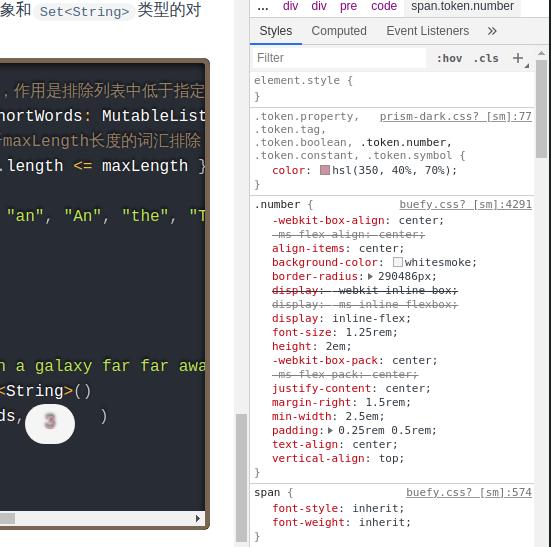
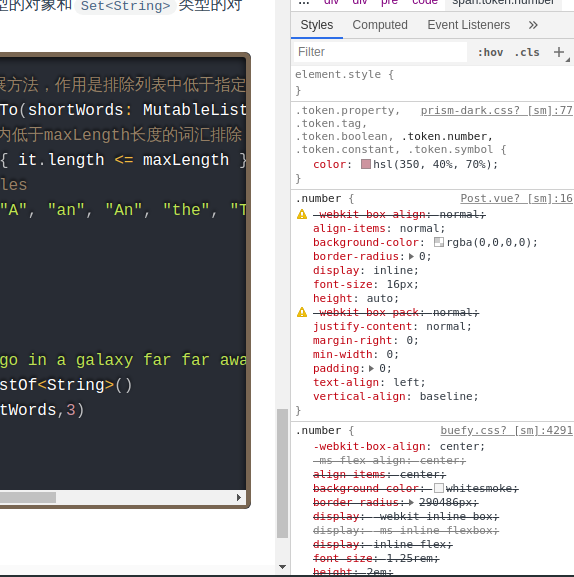

# 解决vuepress引入三方组件库后导致的一些css冲突

Vupress页面里的markdown经过markdown-it（负责文章）和prism（负责代码块）的处理后，会产生最后的HTML代码，但是这可能会和三方组件库出现一些样式的冲突。比如下面这种情况：



可以看到这个“3”显示是有问题的，打开chrome选中属性可以看到prism处理代码块以后对其加上了"number"这个class，而刚好buefy也有这个class，于是buefy也对它加上了自己的样式，但是我们并不需要buefy的样式。

解决思路是在`<Content>`（也就是markdown渲染的地方）所在的vue组件内写一个number class的样式，去覆盖掉buefy的样式，便可解决。

但是问题来了，按道理需要给number加上相应的css属性的浏览器默认样式，就可以解决这个问题，但是我们怎么知道这些css属性的默认样式呢，难道要挨个搜索吗？

其实很简单，可以打开chrome的控制台，找到styles选项卡，然后勾掉多余的buefy样式，再去Computed选项卡，看一下去掉buefy以后相应属性的计算属性。这个就是我们要给number class覆盖的属性了。

最后我们加上这段代码

``` stylus
  .number 
    align-items: normal
    background-color: rgba(0, 0, 0, 0)
    border-radius: 0
    display: inline
    font-size: 16px
    height: auto
    justify-content: normal 
    margin-right: 0
    min-width: 0
    padding: 0
    text-align: left 
    vertical-align: baseline
```



OK!大功告成！