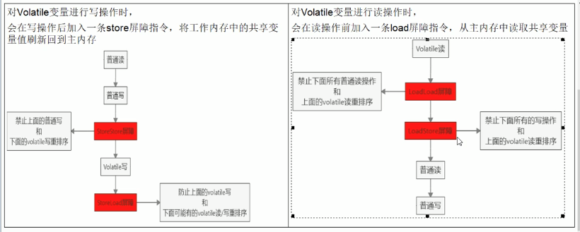

# 常见面试题总结（持续更新）

## C语言

### 数据类型大小

c语言中的union是联合体，就是一个多个变量的结构同时使用一块内存区域，区域的取值大小为该结构中长度最大的变量的值;

32/64位编译器下，char为1字节，int为4字节，double为8字节。long分别为4字节和8字节。

## java

### arraylist扩充陷阱

ArrayList list=new ArrayList();

这种是默认创建大小为10的数组，每次扩容大小为1.5倍

ArrayList list=new ArrayList(20);

这种是指定数组大小的创建，创建时直接分配其大小，没有扩充。

### 使用红黑树实现的集合
Java的HashMap、TreeMap、TreeSet

### static块作用

static是类级别的初始化，只是在类加载的时候做一次，后面不再加载。

### equals()和==

equals比较对象的hashcode，判定值是否相等。

而==判定地址是否相等。

### volatile 

- 保证可见性
- 不保证原子性（Synchronize是保证的）
- 禁止指令重排

>指令重排序是JVM为了优化指令,提高程序运行效率。指令重排序包括编译器重排序和运行时重排序。JVM规范规定,指令重排序可以在不影响单线程程序执行结果前提下进行。（单线程下代码顺序和执行顺序一致，多线程不一定，结果无法预测）

重排序需要考虑指令间的**数据依赖性** 。（总不可能先使用后声明）

volatile禁止了指令重排序，避免多线程中非依赖型的数据乱序执行。

不保证原子性的原因：是因为当有线程写回新值到主内存时，一些线程可能处于挂起状态，无法收到同步更新工作内存值的通知，因而复写了错误的值回主内存。

### 内存屏障 / Memory Barrier

内存屏障又叫内存栅栏，是一个cpu指令，它的作用有两个：

1. 保证特定操作的执行顺序
2. 保证某些变量的内存可见性（利用该特性实现volatile的内存可见性）

编译器和处理器都可以执行指令重排优化。如果在指令间插入一条Memory Barrier则会告诉编译器和cpu，不管什么指令都不和Memory Barrier指令重排序。也就是说，**通过插入内存屏障禁止在内存屏障前后的指令执行重排序优化。** 内存屏障另一个作用是强制刷出各种cpu的缓存数据，因此cpu上的线程都能收到这些数据的最新版本。



### JMM （Java 内存模型/memory model）

JMM实际上是一组规范，定义了各种变量的访问方式。JMM规定所有变量都存在主内存中。

工作内存（栈空间）的概念：当多个线程去修改对象的值时，不是直接在主内存中修改，而回先将值拷贝回各自的工作内存，再写回主内存。

但是这样多个线程修改一个变量会导致线程不安全，因为一个线程修改完值，其余线程是不知道的。

达到以下三点即线程安全：

- JMM有可见性
- 原子性
- 有序性

工作内存与主内存的同步延迟现象导致的可见性问题，可以使用Synchronized或是Volatile关键字解决，它们都可以使一个线程**修改后的变量立即对其他线程可见。**

对于指令重排导致的可见性问题与有序性问题，使用volatile关键字解决，因为volatile的另一个作用就是禁止重排序优化。

### 为什么atomic可以做到原子性

CAS : Conmpare And Swap / 比较和交换

compareAndSawp：用于实现多线程同步的原子指令，将主内存的值与工作内存的值相比较，若相同则执行指定操作，否则会在do while循环中持续比较。这个过程是原子的。

CAS应用：CAS有3个操作数，内存为V，旧值为A，新值为B。当且仅当A和V相同，V改为B，否则什么都不做。

实际上CAS是一条cpu并发原语。

底层原理：使用了unsafe类

Unsafe类：unsafe是cas核心类。java本身无法直接访问底层系统，需要通过本地（native）方法来访问，Unsafe相当于一个后门，基于该类可以直接操作特定的内存数据。在jdk9以后unsafe被移动到java.unsupported中，内部方法可以像操作指针一样操作内存，java中CAS操作的执行依赖于unsafe方法。

**Unsafe类中所有方法都是native类修饰的，也就是说unsafe类中的方法都直接调用os底层资源执行相应任务。**

unsafe类中可以见到名为valueOffset的变量，它表示变量值在内存中的偏移地址，因为unsafe就是根据内存偏移地址获取数据。

unsafe类中的compareAndSwapInt是一个native方法，该方法的实现位于unsafe.cpp。

CAS并发原语体现在unsafe类中的各个方法。调用unsafe类中的cas方法，jvm会帮我们实现出CAS汇编指令。这是一种完全依赖于硬件的功能，通过它实现了原子操作。CAS是一种系统原语，原语属于操作系统用语范畴，是指完成某一功能的若干指令。**原语本身就是原子的。**

为什么多线程里倾向于用原子数据里的CAS方法更新数据而不是Synchronized？因为Synchronized只有一个线程才能访问方法，并发性会下降。而CAS可以在保证一致性的情况下提高并发性（do-while结构）。

若一个线程的原子数据方法内部发现已经某数据已经和原始值不一样会发生什么？CAS会在while判断中发现数据已更新，并且拒绝赋值，而在do中将内存中的新值取出同步。

CAS缺点：

1. cas靠一个do while死循环，如果cas一直不成功，cpu开销会很大。
2. cas只可以保证一个共享变量的原子性。而多个共享变量无法达到原子性，可以通过加锁来实现。
3. 会导致ABA问题

### ABA问题 / ABA problem

CAS算法是先取出主内存的值到工作内存，再进行比较，这中间会有时间差。如果线程2先修改主内存为另一个值，再改回来。那么在线程1看来这个值就是没有变过的，可以直接执行cas操作。

**尽管线程1的cas操作成功，但是不表示这个过程没有问题。** 参阅[知乎](https://zhuanlan.zhihu.com/p/97830752)

ABA的解决：原子引用（atomic reference）+修改版本号（类似时间戳）

或者直接使用： AtomicStampedReference，带时间戳的原子引用。

### 解决ArrayList多线程下的ConcurrentModificationException

产生原因：因为并发争抢修改，一个线程正在写入而另一个线程立即读取，导致数据不一致。

解决方法：

1. 使用Vector（观察源码可以发现Vector是自带Syncronized锁的）
2. Collections.syncronizedList(new ArrayList<>()),包装ArrayList使其同步。
3. CopyOnWriteArrayList()（写时复制）

写时复制如何解决ConcurrentModificationException：当向一个容器添加元素时，不直接往容器的Object[]添加，而是选择先拷贝当前容器，然后再对复制来的容器修改。之后引用指向复制后的容器。这样做的好处是可以对CopyOnWrite容器进行并发的读，而不需要加锁，因为读取时不会有任何元素添加进去。CopyOnWrite使用的也是一种读写分离的思想，读和写使用不同的容器。

### hashSet的底层

hashSet的底层结构就是hashMap。set的值作为map 键，而map的值是一个空的Object常量。

### 可重入锁（递归锁）的实现

重入锁默认由非公平锁实现（NonfairSync），也可以传入true来使用公平锁的实现（FairSync）。

- 公平锁：是指多个线程按照申请锁的顺序来获取锁，FIFO，不可插队抢锁。
- 非公平锁：多个线程获取锁的顺序不是按照申请锁的顺序。有可能后申请的线程优先获取锁，在高并发的情况下，有可能会造成优先级反转或者饥饿的现象。

非公平锁的吞吐量比公平锁大。Synchronized也是一种非公平锁。

递归锁概念：同一个线程获取到外层方法的锁后，会自动获取到内层方法的锁。Synchronized和ReentrantLock均为递归锁。

### 自旋锁 / Spinlock

自旋锁是指尝试获取锁的线程不会立即阻塞，**而是采用循环的方式去获取锁** ，这样的好处是减少线程上下文的切换的消耗，缺点是循环会消耗CPU。（比如cas的实现）

## 常见排序空间复杂度的时间空间复杂度

平均时间复杂度：

n^2的有：直接插入排序，直接选择排序，冒泡排序
nlog2n的有：希尔排序，堆排序，快速排序，归并排序

空间复杂度：

快排nlog2n，归并为n，其他空间复杂度为1

稳定性：

稳定：直接插入排序，冒泡排序，归并排序，基数排序。

不稳定： 希尔排序，直接选择排序，堆排序，快速排序。

## 软件工程的基本原则

抽象，信息隐蔽，模块化，局部化，确定性，一致性，完备性，可验证性

不包括：自底向上

一般地，可以将软件开发的生命周期划分为软件项目计划、______(需求分析与定义)、软件设计、编码、测试和运行/维护6个阶段。

## SQL

查询第二名，以身高为例：先查询出最高的身高值，然后查询身高小于该值的最高身高。

```sql
select MAX(height) from users where height < (select MAX(height) from users );
```

sql别名：

``` sql
 select custid, custname,branchid from clientinfo a where not exists (select 1 from acctbalance  b where a.custid = b.custid)
```
这里a,b即为别名，一般来说要在a，b，前加AS。但是省略效果也是一样的。

在数据库中，产生数据不一致的根本原因是（数据冗余）

## SQL

### 线程状态

1.新建状态(New)： 
  当用new操作符创建一个线程时， 例如new Thread(r)，线程还没有开始运行，此时线程处在新建状态。 当一个线程处于新生状态时，程序还没有开始运行线程中的代码

2.就绪状态(Runnable)

  一个新创建的线程并不自动开始运行，要执行线程，必须调用线程的start()方法。当线程对象调用start()方法即启动了线程，start()方法创建线程运行的系统资源，并调度线程运行run()方法。当start()方法返回后，线程就处于就绪状态。

        处于就绪状态的线程并不一定立即运行run()方法，线程还必须同其他线程竞争CPU时间，只有获得CPU时间才可以运行线程。因为在单CPU的计算机系统中，不可能同时运行多个线程，一个时刻仅有一个线程处于运行状态。因此此时可能有多个线程处于就绪状态。对多个处于就绪状态的线程是由Java运行时系统的线程调度程序(thread scheduler)来调度的。


    3.运行状态(Running)

        当线程获得CPU时间后，它才进入运行状态，真正开始执行run()方法.

    4. 阻塞状态(Blocked)

        线程运行过程中，可能由于各种原因进入阻塞状态:
        1>线程通过调用sleep方法进入睡眠状态；
        2>线程调用一个在I/O上被阻塞的操作，即该操作在输入输出操作完成之前不会返回到它的调用者；
        3>线程试图得到一个锁，而该锁正被其他线程持有；
        4>线程在等待某个触发条件；
           ......           
        所谓阻塞状态是正在运行的线程没有运行结束，暂时让出CPU，这时其他处于就绪状态的线程就可以获得CPU时间，进入运行状态。

    5. 死亡状态(Dead)

        有两个原因会导致线程死亡：
         1) run方法正常退出而自然死亡，
         2) 一个未捕获的异常终止了run方法而使线程猝死。
        为了确定线程在当前是否存活着（就是要么是可运行的，要么是被阻塞了），需要使用isAlive方法。如果是可运行或被阻塞，这个方法返回true； 如果线程仍旧是new状态且不是可运行的， 或者线程死亡了，则返回false.

### java面向对象三特性

封装，继承，多态

（没有泛型，没有泛型）

## 计算机网络

### TCP 粘包和半包 介绍及解决

TCP 传输中，客户端发送数据，实际是把数据写入到了 TCP 的缓存中，粘包和半包也就会在此时产生。

客户端给服务端发送了两条消息ABC和DEF，服务端这边的接收会有多少种情况呢?有可能是一次性收到了所有的消息ABCDEF，有可能是收到了三条消息AB、CD、EF。

上面所说的一次性收到了所有的消息ABCDEF，类似于粘包。如果客户端发送的包的大小比 TCP 的缓存容量小，并且 TCP 缓存可以存放多个包，那么客户端和服务端的一次通信就可能传递了多个包，这时候服务端从 TCP 缓存就可能一下读取了多个包，这种现象就叫粘包。

上面说的后面那种收到了三条消息AB、CD、EF，类似于半包。如果客户端发送的包的大小比 TCP 的缓存容量大，那么这个数据包就会被分成多个包，通过 Socket 多次发送到服务端，服务端第一次从接受缓存里面获取的数据，实际是整个包的一部分，这时候就产生了半包(半包不是说只收到了全包的一半，是说收到了全包的一部分)。

#### 产生原因

其实从上面的定义，我们就可以大概知道产生的原因了。

粘包的主要原因：

发送方每次写入数据 < 套接字(Socket)缓冲区大小
接收方读取套接字(Socket)缓冲区数据不够及时
半包的主要原因：

发送方每次写入数据 > 套接字(Socket)缓冲区大小
发送的数据大于协议的 MTU (Maximum Transmission Unit，最大传输单元)，因此必须拆包
其实我们可以换个角度看待问题：

从收发的角度看，便是一个发送可能被多次接收，多个发送可能被一次接收。
从传输的角度看，便是一个发送可能占用多个传输包，多个发送可能共用一个传输包。

#### 根本原因，其实是

TCP 是流式协议，消息无边界。

(PS ： UDP 虽然也可以一次传输多个包或者多次传输一个包，但每个消息都是有边界的，因此不会有粘包和半包问题。)

#### 解决方法

就像上面说的，UDP 之所以不会产生粘包和半包问题，主要是因为消息有边界，因此，我们也可以采取类似的思路。

### HTTP状态码

- 1XX：通知
- 2XX：成功
- 3XX：重定向
- 4XX：客户端错误
- 5XX：服务端错误

### 算相同主机ip相与

子网掩码与主机ip相与，若相同则同一网段。但要记住全1为广播地址，不是主机ip。

## 操作系统

产生死锁的四个必要条件：

1. 互斥条件：一个资源每次只能被一个进程使用。
2. 请求与保持条件：一个进程因请求资源而阻塞时，对已获得的资源保持不放。
3. 不剥夺条件:进程已获得的资源，在末使用完之前，不能强行剥夺。
4. 循环等待条件:若干进程之间形成一种头尾相接的循环等待资源关系。

在下列解决死锁的方法中，属于死锁预防策略的是 ( 资源有序分配法)

在解决死锁的方法中，死锁的预防是设法至少破坏产生死锁的必要条件之一，严格预防死锁出现。银行家算法属于死锁的避免，不那么严格地限制产生死锁的必要条件的存在，而是在系统运行过程中小心地避免死锁的最终发生。死锁检测算法，允许死锁发生，定期检测。所以，只有资源有序分配法属于预防死锁的策略。

采用有序资源分配法：R1的编号为1，R2的编号为2；PA：申请次序应是：R1，R2PB：申请次序应是：R1，R2这样就破坏了环路条件，避免了死锁的发生

### 内存分页

计算页面大小：页面大小由页内偏移量（页内位移）决定。

按字节编址，逻辑地址和物理地址都是 32 位，页表项大小为 4 字节。页号20位，若页内偏移量是12位值，那么：

页面大小2^12=4*1024=4kB

页表项数量:2^32/(4*1024)=2^20

页表总大小:2^20*4B=4MB

### 临界资源

多道程序系统中存在许多进程，它们共享各种资源，然而有很多资源一次只能供一个进程使用。一次仅允许一个进程使用的资源称为临界资源。许多物理设备都属于临界资源，如输入机、打印机、磁带机等。

## Linux

### Linux中进程的阻塞和挂起的区别

理解一：挂起是一种主动行为，因此恢复也应该要主动完成，而阻塞则是一种被动行为，是在等待事件或资源时任务的表现，你不知道他什么时候被阻塞(pend)，也就不能确切的知道他什么时候恢复阻塞。而且挂起队列在操作系统里可以看成一个，而阻塞队列则是不同的事件或资源（如信号量）就有自己的队列。

理解二：阻塞（pend）就是任务释放CPU，其他任务可以运行，一般在等待某种资源或信号量的时候出现。挂起（suspend）不释放CPU，如果任务优先级高就永远轮不到其他任务运行，一般挂起用于程序调试中的条件中断，当出现某个条件的情况下挂起，然后进行单步调试。

理解三：pend是task主动去等一个事件,或消息.suspend是直接悬挂task,以后这个task和你没任何关系,任何task间的通信或者同步都和这个suspended task没任何关系了,除非你resume task;

理解四：任务调度是操作系统来实现的，任务调度时，直接忽略挂起状态的任务，但是会顾及处于pend下的任务，当pend下的任务等待的资源就绪后，就可以转为ready了。ready只需要等待CPU时间，当然，任务调度也占用开销，但是不大，可以忽略。可以这样理解，只要是挂起状态，操作系统就不在管理这个任务了。

理解五：挂起是主动的，一般需要用挂起函数进行操作，若没有resume的动作，则此任务一直不会ready。而阻塞是因为资源被其他任务抢占而处于休眠态。两者的表现方式都是从就绪态里“清掉”，即对应标志位清零，只不过实现方式不一样。
挂起和阻塞最大的区别我想是数据所在的位置。挂起后，数据被调到外存上，而阻塞后，数据仍留在主存中，只有挂起状态下的阻塞即静止阻塞状态，数据才被调到外存上


### chmod

操作文件或目录的用户，有3种不同类型：文件所有者(User)、群组用户(Group)、其他用户(others)。

下划线可以是rwx：

d _ _ _ （User） _ _ _ （Group） _ _ _ (others)

- r read=4=100
- w write=2=010
- x execute=1=001
- \- No right=0=000

## 计算机网络

### 数据链路层

在局域网模型中，数据链路层分为：逻辑链路控制子层(LLC)和媒体访问控制子层(MAC)。

链路层的意义：物理层的线路有传输介质与通信设备组成，比特流在传输介质上传输时肯定会存在误差的。这样就引入了数据链路层在物理层之上，采用差错检测、差错控制和流量控制等方法， **向网络层提供高质量的数据传输服务。**

- MAC子层：MAC子层的的主要功能为**数据帧的封装/卸装，帧的寻址和识别，帧的接收与发送，链路的管理，帧的差错控制。**
- LLC子层：LLC子层的主要功能为**传输可靠性保障和控制，数据包的分段与重组，数据包的顺序传输。**

## TCP

### 0其他

数组A[0...4,-1...-3,5...7]中含有的元素个数是?

每维个数=上限-下限+1
4-0+1=5
-1-(-3)+1=3
7-5+1=3
5*3*3=45

### 以下代码的输出结果

``` java
public class B
{
    public static B t1 = new B();
    public static B t2 = new B();
    {
        System.out.println("构造块");
    }
    static
    {
        System.out.println("静态块");
    }
    public static void main(String[] args)
    {
        B t = new B();
    }
}
```

构造块 构造块 静态块 构造块

1.执行顺序：静态代码块>构造代码块>构造方法
    
    理由：
    
    静态代码块（static{}）在类加载的时候执行一次。
    
    构造代码块（{}内的部分）在每一次创建对象时执行，始终在构造方法前执行。
               
    构造方法在新建对象时调用（就是new的时候 ）。
    
    注意： 
    
    a.静态代码块在类加载的时候就执行，所以它的优先级高于入口main()方法。
    
    b.当三种形式不止一次出现，同优先级是按照先后顺序执行。

总结一下： 1.程序入口main方法要执行首先要加载类B 2.静态域：分为静态变量，静态方法，静态块。这里面涉及到的是静态变量和静态块，当执行到静态域时，按照静态域的顺序加载。并且静态域只在类的第一次加载时执行 3.每次new对象时，会执行一次构造块和构造方法，构造块总是在构造方法前执行（当然，第一次new时，会先执行静态域，静态域〉构造块〉构造方法） 注意：加载类时并不会调用构造块和构造方法，只有静态域会执行 4.根据前三点，首先加载类B，执行静态域的第一个静态变量，static b1=new B，输出构造块和构造方法（空）。ps:这里为什么不加载静态方法呢？因为执行了静态变量的初始化，意味着已经加载了B的静态域的一部分，这时候不能再加载另一个静态域了，否则属于重复加载 了（静态域必须当成一个整体来看待。否则加载会错乱） 于是，依次static b2 =new B，输出构造块，再执行静态块，完成对整个静态域的加载，再执行main方法，new b，输出构造块。

## JVM

运行时数据区包括：程序计数器、虚拟机栈、本地方法栈、Java堆、方法区以及方法区中的运行时常量池

1、程序计数器： 线程私有，是当前线程所执行的字节码的行号指示器，如果线程正执行一个java方法，计数器记录正在执行的虚拟机字节码指令的地址，如果线程正在执行的是Native方法，则计数器值为空；

2、虚拟机栈： 即栈区， 线程私有 ，为虚拟机执行 Java 方法（字节码）服务，每个方法在执行的时会创建一个栈帧用于存放局部变量表、操作数栈、动态链接和方法出口等信息，每个方法的调用直至执行完成对应于栈帧的入栈和出栈；

3、本地方法栈： 为虚拟机使用的 N ative 方法服务，也是 线程私有 ；

4、Java 堆： 在虚拟机启动时创建， 线程共享 ，唯一目的是存放对象实例，是垃圾收集器管理的主要区域——” GC 堆“，可以细分为新生代和老年代，新生代又可以细分为 Eden 空间、 From Survivor 空间和 To Survivor 空间；物理上可以不连续，但逻辑上连续，可以选择固定大小或者扩展；

5、方法区： 线程共享 ，用于存储被虚拟机加载的类信息、常量、静态变量、即时编译器编译后的代码等数据。被称为“永久代”，是因为 H otSpot 虚拟机的设计团队把 GC 分代收集扩展到方法区，即使用永久代来实现方法区，像 GC 管理 Java 堆一样管理方法区，从而省去专门为方法区编写内存管理代码，内存回收目标是针对常量池的回收和堆类型的卸载；

6、运行时常量池： 线程共享 ，是方法区的一部分， C lass 文件中存放编译期生成的各种字面量和符号引用，类加载后进入方法区的运行时常量池中。
答案就是C错，方法区应该是线程共享的。

### 作用域在老年代的GC有

Serial Old收集器/Paraller Old收集器/CMS收集器

### 线程池拒绝策略

1. 直接丢弃（DiscardPolicy）(无异常信息)
2. 丢弃队列中最老的任务(DiscardOldestPolicy)。
3. 抛异常(AbortPolicy)
4. 将任务分给调用线程来执行(CallerRunsPolicy)。

## 数据结构

最大堆：根结点的键值是所有堆结点键值中最大者，且每个结点的值都比其孩子的值大。

最小堆：根结点的键值是所有堆结点键值中最小者，且每个结点的值都比其孩子的值小。